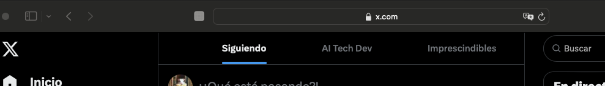
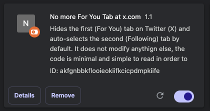
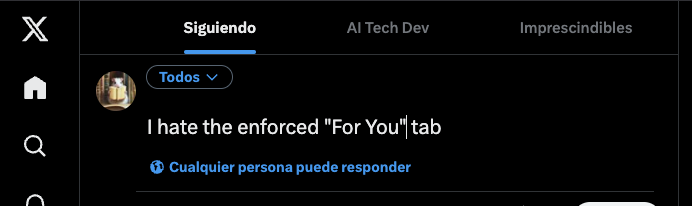
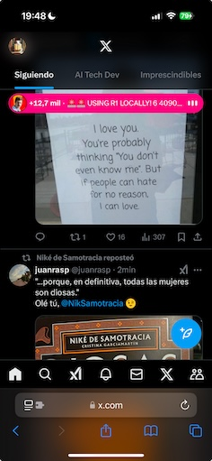

# X.com For You Blocker extension

**ForYouBlocker** is a lightweight and easy-to-read Google Chrome and Safari
extension that hides the distracting "For You" tab on Twitter (now X.com) and
automatically selects the "Following" tab by default.

This tool was created for users who prefer a happy X.com experience, and without
a complicated web extension with many options or weird unknown changes.

It just does one simple thing well, and the code is so straightworward to read
so even novel programers are sure there is no malware or whatsoever.

> **Note:**\
> You need to install it all by yourself, I did not pack it and upload it to the
> App Store.
>
> It is not published on the Chrome Web Store in order to keep things simple and
> to avoid certain Google policies.
>
> The same goes about publishing to the apple App Store, I just do not want to
> pay the fee to publish just an extension.
>
> If you want that I compile it and publish in the Apple Store or the Chrome
> Store, open an issue about the will to make me a donation (it takes about $99
> to get the developer plan for Apple)

## Project Structure

- **ForYouBlocker/**\
  Contains the source code of the extension:
  - `manifest.json` – The extension manifest.
  - `content.js` – The script that hides the "For You" tab and activates the
    "Following" tab.

- **ForYouBlocker.crx**\
  The packaged Chrome extension file.

- **LICENSE.txt**\
  Contains the MIT License.

- **README.md**\
  This documentation file.

## Installation Instructions for Google Chrome or Brave (on desktop)

Since the extension is not distributed via the Chrome Web Store, you have two
options for installation:

#### Method 1: Installing the Packaged (.crx) Extension

1. **Download the [ForYouBlocker.crx](ForYouBlocker.crx) file.**

2. **Open Chrome or Brave** and navigate to: `chrome://extensions` or
   `brave://extensions`

3. **Enable Developer Mode**\
   Toggle the "Developer mode" switch in the top-right corner of the Extensions
   page.

4. **Drag and Drop**\
   Drag the `ForYouBlocker.crx` file into the Extensions page.\
   When prompted, click **Add extension** to confirm the installation.

> **Note:**\
> If dragging the file doesn’t work (or if Chrome/Brave blocks the
> installation), try Method 2.

#### Method 2: Loading the Unpacked Extension

1. **Clone or Download the Repository**\
   Make sure you have the full project folder (including the `ForYouBlocker`
   folder with `manifest.json` and `content.js`).

2. **Open Chrome or Brave** and go to: `chrome://extensions` or
   `brave://extensions`

3. **Enable Developer Mode**\
   (Toggle the switch in the top-right corner.)

4. **Click "Load unpacked"**\
   Browse to and select the `ForYouBlocker` folder (the folder containing your
   manifest and source code).

5. The extension should now load and be active.

## Installation Instructions for Safari (Mac and iOS)

It requires Mac developer tools and to enable iphone developer mode. So git
clone this repository and install Apple's developer tools (xcode) and get a
cable to plug your phone to the computer.

#### Compile it (not optional)

Make sure you have xcode installed and you are in a mac:

`xcrun safari-web-extension-converter --project-location ForYouBlocker-ios $(pwd)/ForYouBlocker`

Xcode will be open, click on: Product > Build

#### Install on Safari (Mac)

1. Follow the official instructions (safari settings, developer, allow
   unassigned extensions and then enable it). But better read
   [The official documentation from apple](https://developer.apple.com/documentation/safariservices/running-your-safari-web-extension)
   since soon the extensions will have the same rules as an app.
2. Open x.com or reload the wbpage
3. If you followed the path of a "unsigned extensions" a white square with an
   exclamation mark next to the address bar will appear, clock on it and select
   "always allow on this website".
4. Your extension should be active

#### Install on iPhone or iPad

Follow the
[official instructions](https://developer.apple.com/documentation/safariservices/running-your-safari-web-extension)
which is mostly:

1. Complete the Mac installation first
2. Enable developer mode on your iphone and restart it
3. Plug the iphone to your mac
4. Run and install the application from xcode.
5. If only compiles for mac's safari, remember to configure the project and
   under targets, add the destination "iPhone"

### If I install it as a PWA....

If you add the safari page as a PWA, unfortunately at this point in time, safari
does not allow to run browser extensions in them.

## License

This project is licensed under the MIT License. See the
[LICENSE.txt](LICENSE.txt) file for details.

---

## Final Remarks

ForYouBlocker is designed to be simple and transparent. The code is easy to read
and modify, so feel free to fork, contribute, or use it as inspiration for your
own projects.

Happy browsing!
